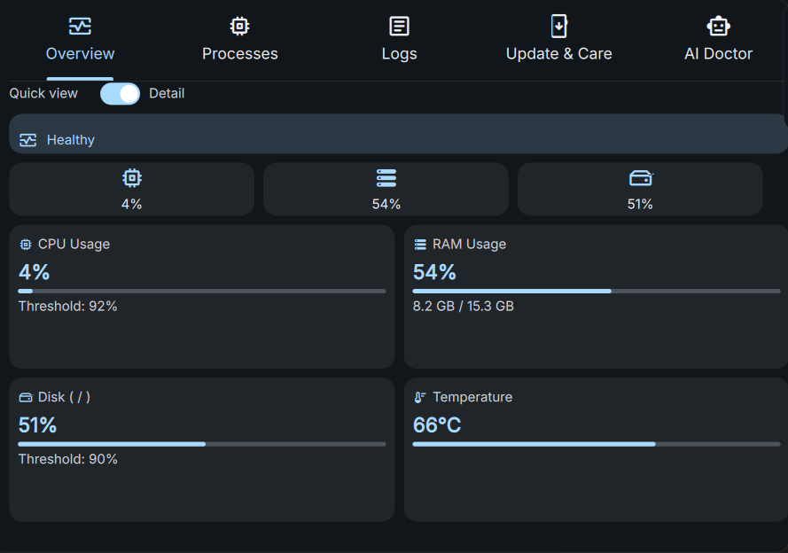
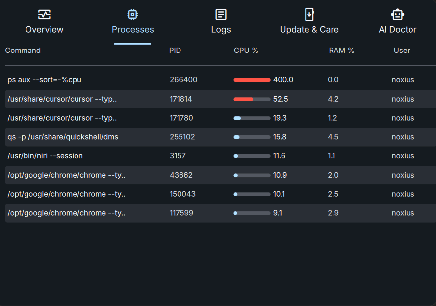
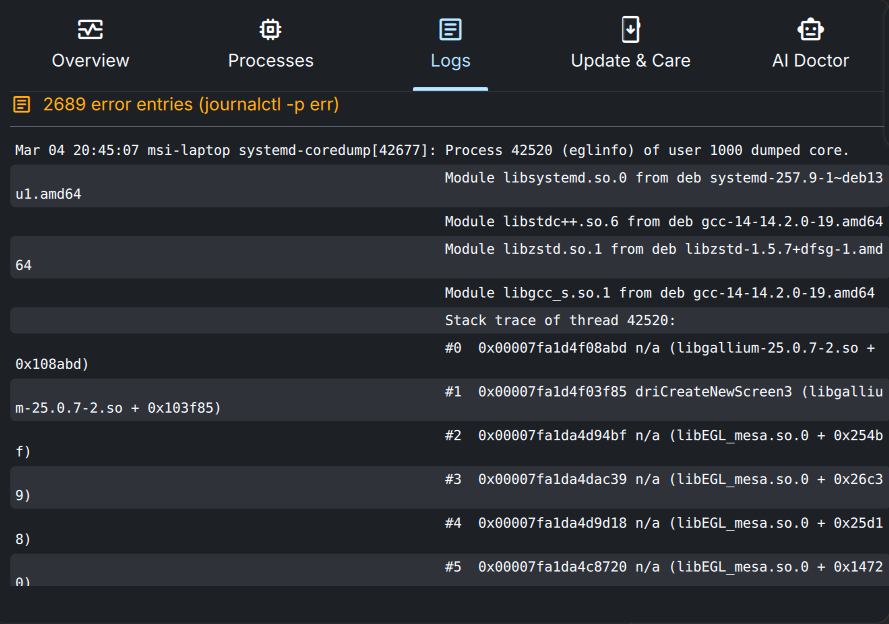
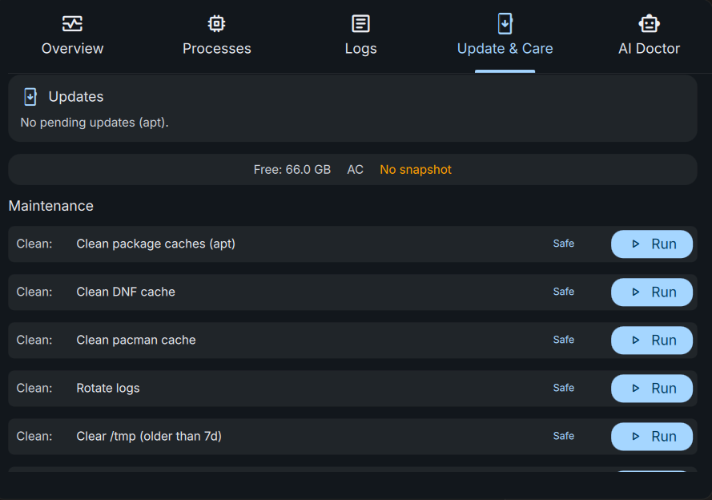

# Dank System Doctor

AI-powered system health monitor plugin for [DankMaterialShell](https://github.com/AvengeMedia/DankMaterialShell). Tracks CPU, RAM, disk, GPU & temp in real-time, detects pending updates, and uses local AI ([Ollama](https://ollama.com)) to diagnose issues and suggest one-click fixes.

## Features

- **Live metrics** — CPU, RAM, disk usage and temperature, updated every 5 seconds; GPU (utilization, VRAM, temp) when `nvidia-smi` is available, polled every 15s
- **Health score** — 0–100 with **adaptive thresholds** (historical baseline + margin) or fixed; status pill shows Healthy/Warning/Critical with reason text
- **Compact + detail view** — quick-glance gauges and expandable metric cards that fill the window
- **Pending updates** — detects apt, dnf, pacman, Homebrew; shows count, security/bugfix, ETA; **Update now** with optional snapshot-first and rollback note
- **One-click maintenance** — clean caches (apt/dnf/pacman), rotate logs, clear /tmp, TRIM SSD, repair broken packages; **safe-mode prechecks** (free space, battery/AC, snapshot)
- **Snapshot/restore guardrail** — Timeshift, Btrfs, or ZFS snapshot before destructive actions
- **Process monitor** — top CPU consumers with mini progress bars
- **Log viewer** — recent `journalctl` error entries, polled every 30 seconds
- **AI Doctor** — summarized context and **triage playbooks** (high CPU by process, memory leak, disk I/O); one-click "Apply Fix" with root via `pkexec`

## Screenshots

| Overview | Processes |
|----------|-----------|
| [](screenshots/overview.png) | [](screenshots/processes.png) |

| Logs | Update & Care |
|------|----------------|
| [](screenshots/logs.png) | [](screenshots/update-care.png) |

*Overview — metric cards with live progress bars and quick-glance gauges · Processes — top CPU consumers · Logs — recent journal errors · Update & Care — updates status and maintenance actions*

## Requirements

| Dependency | Purpose |
|------------|---------|
| [DankMaterialShell](https://github.com/AvengeMedia/DankMaterialShell) ≥ 1.4.0 | Shell framework |
| [Ollama](https://ollama.com) | Local AI backend |
| `bash`, `ps`, `free`, `df`, `journalctl` | System metric collection (standard on any Linux system) |

## Installation

### Via DMS Plugin Manager (recommended)

1. Open DankMaterialShell Settings → Plugins → Install
2. Enter the repo URL: `NordicsSys/DankSystemDoctor`
3. Enable the plugin and add it to your bar

### Manual

```bash
cd ~/.config/DankMaterialShell/plugins
git clone https://github.com/NordicsSys/DankSystemDoctor dankSystemDoctor
```

Then add to `plugin_settings.json`:

```json
"dankSystemDoctor": {
    "enabled": true,
    "ollamaModel": "llama3.2",
    "cpuThreshold": 85,
    "ramThreshold": 85,
    "diskThreshold": 90,
    "logInterval": 30
}
```

And add to your bar config in `settings.json`:

```json
{ "id": "dankSystemDoctor", "enabled": true }
```

## Ollama Setup

```bash
# Install Ollama
curl -fsSL https://ollama.com/install.sh | sh

# Pull a model (choose one)
ollama pull llama3.2        # recommended — best balance
ollama pull llama3.2:1b     # fastest, smaller
ollama pull mistral         # good for technical analysis
ollama pull deepseek-r1:7b  # strong reasoning
```

Ollama runs as a systemd service automatically after install. The plugin connects to `http://localhost:11434`.

## Settings

| Setting | Default | Description |
|---------|---------|-------------|
| Ollama Model | `llama3.2` | Model name for AI diagnostics |
| CPU Threshold | 85% | Health score penalty above this |
| RAM Threshold | 85% | Health score penalty above this |
| Disk Threshold | 90% | Health score penalty above this |
| Log Interval | 30s | How often to poll `journalctl` |

## How the Health Score Works

Starts at 100 and loses points when:

- CPU > threshold → −20 (threshold can be **adaptive**: baseline average + margin)
- RAM > threshold → −20
- Disk > threshold → −15
- Temperature > 80°C → −15 (> 90°C → −30)
- Journal errors found → −10 (many errors → −15)
- GPU temp > 90°C (if available) → −15

**Healthy** (80–100) · **Warning** (50–79) · **Critical** (0–49). The status pill shows a short **reason** when not healthy.

## License

MIT
